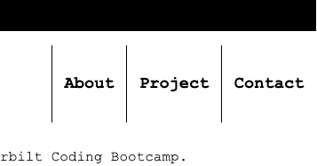
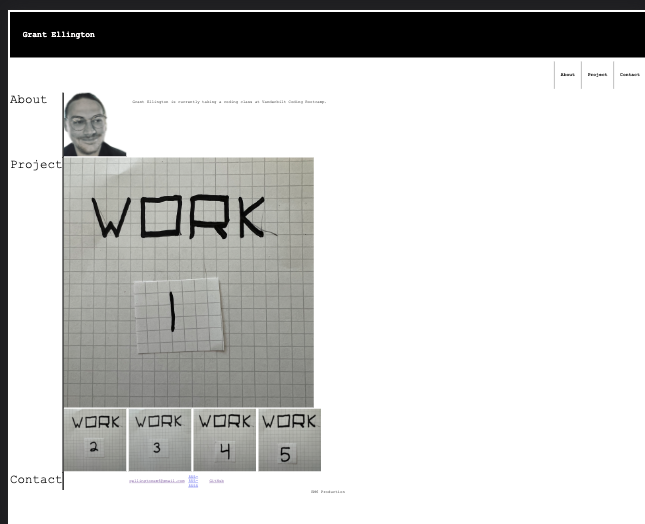
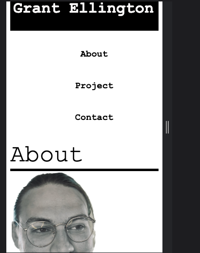

## Table of Contents
  * [License](#License)
  * [Title](#Title)
  * [Description](#Description)
  * [Installation](#Installation)
  * [Usage](#Usage)
  * [Contribution](#Contribution)
  * [Test](#Test)
  * [Technologies](#Technologies)
  * [Questions](#Questions)
  * [Spot-light](#Spot-light)
  
## License

# Personal-Page 
### Grant Ellington
## Description

This is web page to show off my work, provide a personal page, and provide contact information.

## Installation

you can go tot the deplyed link to view the webpage

## Usage Information

N/A

## Contribution 

see the license aggrement

## Test

n/a

## Technologies
Project is created with:
* HTML
* CSS
* 
## Set-up
N/A

## Questions
Grant-Ellington
[gellingtonem6@gmail.com](gellingtonem6@gmail.com)

## Spot-light

Features
* Link tabs

* Link images to projects.
* linked contact with email, phone number, and GitHub account
* responsive design for multiple devices.

